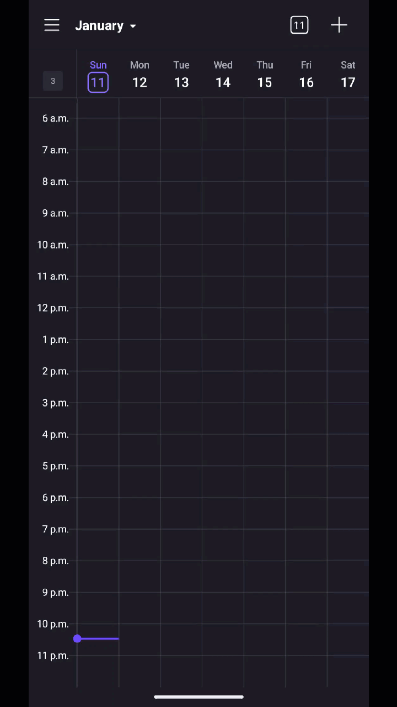
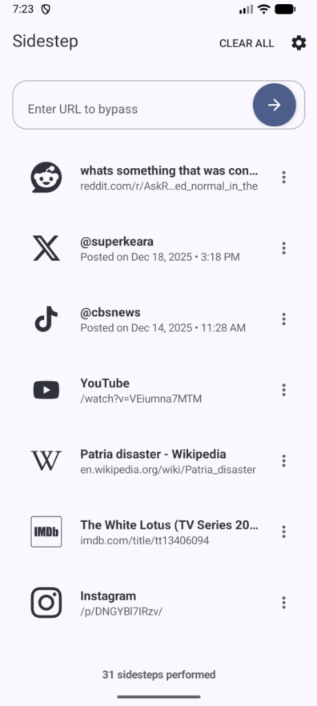
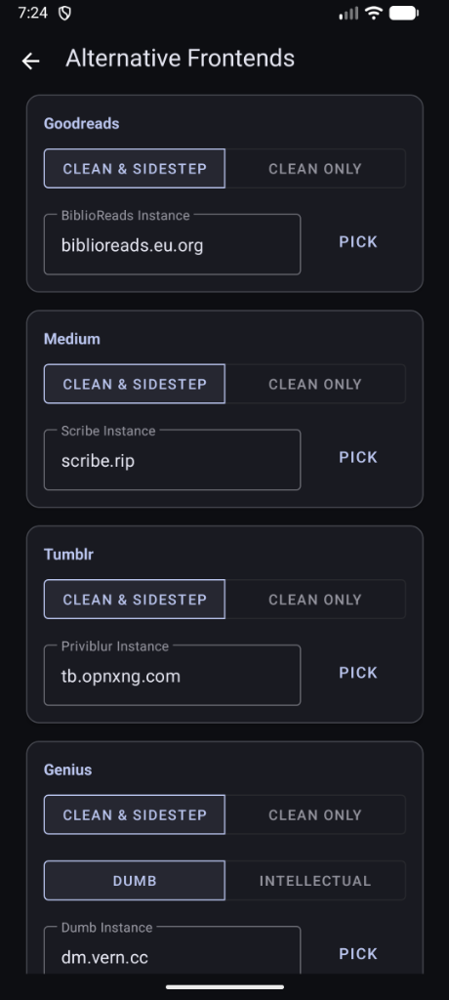
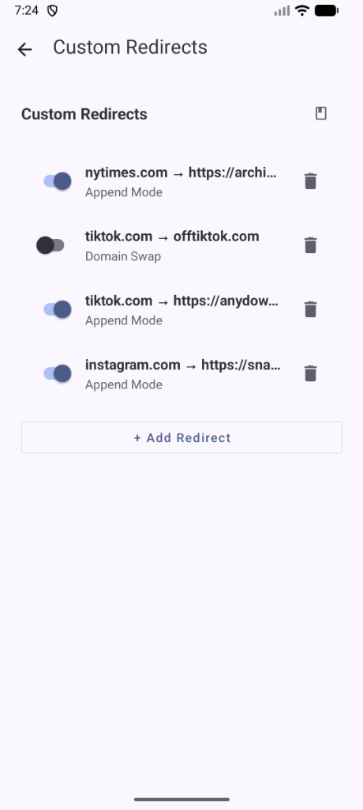

# Sidestep - Redirect to Alternative Frontends

Android app that intercepts social media URLs and redirects them to alternative frontends while removing tracking parameters. No apps or accounts needed to access the content shared with you.

  

  
  
  

<a href="https://apps.obtainium.imranr.dev/redirect?r=obtainium://app/%7B%22id%22%3A%22com.blankdev.sidestep%22%2C%22url%22%3A%22https%3A%2F%2Fgithub.com%2Fblankdotdev%2Fsidestep%22%2C%22author%22%3A%22blankdotdev%22%2C%22name%22%3A%22Sidestep%22%2C%22preferredApkIndex%22%3A0%2C%22additionalSettings%22%3A%22%7B%5C%22includePrereleases%5C%22%3Afalse%2C%5C%22fallbackToOlderReleases%5C%22%3Atrue%2C%5C%22filterReleaseTitlesByRegEx%5C%22%3A%5C%22%5C%22%2C%5C%22filterReleaseNotesByRegEx%5C%22%3A%5C%22%5C%22%2C%5C%22verifyLatestTag%5C%22%3Afalse%2C%5C%22sortMethodChoice%5C%22%3A%5C%22date%5C%22%2C%5C%22useLatestAssetDateAsReleaseDate%5C%22%3Afalse%2C%5C%22releaseTitleAsVersion%5C%22%3Afalse%2C%5C%22trackOnly%5C%22%3Afalse%2C%5C%22versionExtractionRegEx%5C%22%3A%5C%22%5C%22%2C%5C%22matchGroupToUse%5C%22%3A%5C%221%5C%22%2C%5C%22versionDetection%5C%22%3Atrue%2C%5C%22releaseDateAsVersion%5C%22%3Afalse%2C%5C%22useVersionCodeAsOSVersion%5C%22%3Afalse%2C%5C%22apkFilterRegEx%5C%22%3A%5C%22%5C%22%2C%5C%22invertAPKFilter%5C%22%3Afalse%2C%5C%22autoApkFilterByArch%5C%22%3Atrue%2C%5C%22appName%5C%22%3A%5C%22%5C%22%2C%5C%22appAuthor%5C%22%3A%5C%22%5C%22%2C%5C%22shizukuPretendToBeGooglePlay%5C%22%3Afalse%2C%5C%22allowInsecure%5C%22%3Afalse%2C%5C%22exemptFromBackgroundUpdates%5C%22%3Afalse%2C%5C%22skipUpdateNotifications%5C%22%3Afalse%2C%5C%22about%5C%22%3A%5C%22%5C%22%2C%5C%22refreshBeforeDownload%5C%22%3Afalse%2C%5C%22dontSortReleasesList%5C%22%3Afalse%7D%22%2C%22overrideSource%22%3Anull%7D" target="_blank" rel="noopener">
  
</a>

## Features

### Alternative Frontends
Bypass closed ecosystems and access a more open internet - with a less cluttered web experience. Sidestep supports several major platforms with configurable alternatives:

| Platform            | Alternative           |
|---------------------|-----------------------|
| **Twitter/X**       | [Nitter](https://github.com/zedeus/nitter)                |
| **Reddit**          | [Redlib](https://github.com/redlib-org/redlib)                |
| **YouTube**         | [Invidious](https://github.com/iv-org/invidious), [Piped](https://github.com/TeamPiped/Piped)      |
| **Google Maps**     | [OpenStreetMap](https://www.openstreetmap.org/)         |
| **IMDb**            | [LibreMDB](https://github.com/zyachel/libremdb)              |
| **Medium**          | [Scribe](https://sr.ht/~edwardloveall/Scribe)                |
| **Wikipedia**       | [Wikiless](https://github.com/Metastem/wikiless)              |
| **Goodreads**       | [BiblioReads](https://github.com/nesaku/BiblioReads)           |
| **Genius**          | [Dumb](https://github.com/rramiachraf/dumb), [Intellectual](https://github.com/Insprill/intellectual)    |
| **Tumblr**          | [Priviblur](https://github.com/syeopite/priviblur)             |
| **UrbanDictionary** | [RuralDictionary](https://codeberg.org/zortazert/rural-dictionary)       |
| **Imgur**           | [Rimgo](https://codeberg.org/rimgo/rimgo)                 |
| **GitHub**          | [GotHub](https://github.com/neofelix/gothub)                |
| **StackOverflow**   | [AnonymousOverflow](https://github.com/httpjamesm/AnonymousOverflow)     |

### Flexible Configuration & Smart URL Cleaning
Automatically removes tracking parameters from all URLs:
- UTM parameters (`utm_source`, `utm_medium`, etc.)
- Platform-specific trackers (Twitter `s`/`t`, YouTube `si`, Instagram `igsh`)
- E-commerce tracking (Amazon, affiliate links)
- Analytics parameters

Granular control over how URLs are processed:
- **Unshorten URLs**: Automatically resolves shortened links (bit.ly, t.co, etc.)
- **Remove Tracking**: Strip analytics and tracking parameters
- **Immediate Navigation**: Automatically open the processed URL in your browser
- **Clean Only Mode**: Remove tracking without redirecting
- **Clean & Sidestep Mode**: Remove tracking AND redirect to alternative frontend
- **Custom Redirects**: Add your own domain mappings
- **Instance Picker**: Fetch live, healthy instances sorted by uptime

### Tracking-proof
- Previews fetched via DuckDuckGo (optional)
- No Data Collection: Zero analytics, zero tracking
- Local Processing: All URL cleaning happens on-device

## Installation

Sidestep is available as a direct APK download (under [Releases](https://github.com/blankdotdev/sidestep/releases)), or can be built from source. Ideally, it should be installed from [Obtainium](https://apps.obtainium.imranr.dev/redirect?r=obtainium://app/%7B%22id%22%3A%22com.blankdev.sidestep%22%2C%22url%22%3A%22https%3A%2F%2Fgithub.com%2Fblankdotdev%2Fsidestep%22%2C%22author%22%3A%22blankdotdev%22%2C%22name%22%3A%22Sidestep%22%2C%22preferredApkIndex%22%3A0%2C%22additionalSettings%22%3A%22%7B%5C%22includePrereleases%5C%22%3Afalse%2C%5C%22fallbackToOlderReleases%5C%22%3Atrue%2C%5C%22filterReleaseTitlesByRegEx%5C%22%3A%5C%22%5C%22%2C%5C%22filterReleaseNotesByRegEx%5C%22%3A%5C%22%5C%22%2C%5C%22verifyLatestTag%5C%22%3Afalse%2C%5C%22sortMethodChoice%5C%22%3A%5C%22date%5C%22%2C%5C%22useLatestAssetDateAsReleaseDate%5C%22%3Afalse%2C%5C%22releaseTitleAsVersion%5C%22%3Afalse%2C%5C%22trackOnly%5C%22%3Afalse%2C%5C%22versionExtractionRegEx%5C%22%3A%5C%22%5C%22%2C%5C%22matchGroupToUse%5C%22%3A%5C%221%5C%22%2C%5C%22versionDetection%5C%22%3Atrue%2C%5C%22releaseDateAsVersion%5C%22%3Afalse%2C%5C%22useVersionCodeAsOSVersion%5C%22%3Afalse%2C%5C%22apkFilterRegEx%5C%22%3A%5C%22%5C%22%2C%5C%22invertAPKFilter%5C%22%3Afalse%2C%5C%22autoApkFilterByArch%5C%22%3Atrue%2C%5C%22appName%5C%22%3A%5C%22%5C%22%2C%5C%22appAuthor%5C%22%3A%5C%22%5C%22%2C%5C%22shizukuPretendToBeGooglePlay%5C%22%3Afalse%2C%5C%22allowInsecure%5C%22%3Afalse%2C%5C%22exemptFromBackgroundUpdates%5C%22%3Afalse%2C%5C%22skipUpdateNotifications%5C%22%3Afalse%2C%5C%22about%5C%22%3A%5C%22%5C%22%2C%5C%22refreshBeforeDownload%5C%22%3Afalse%2C%5C%22dontSortReleasesList%5C%22%3Afalse%7D%22%2C%22overrideSource%22%3Anull%7D) to allow for automatic updates.

## Usage

### Quick Start
1. Install Sidestep
2. Share a social media link to Sidestep, or open a supported link
3. Sidestep will clean and optionally redirect the URL
4. Your default browser opens the cleaned/redirected link

### Setting as Default Handler
1. Open Sidestep → **Settings**
2. Tap **Set as Default**
3. Select **Open in app** for supported domains
4. Supported links will now automatically route through Sidestep

## Verification

To ensure your Sidestep build is genuine and hasn't been tampered with, you can verify it using [AppVerifier](https://github.com/soupslurpr/AppVerifier).

**Package Name:** `com.blankdev.sidestep`
**SHA-256 Hash:** `D5:69:98:17:CC:CE:5F:F6:0B:8C:4B:1A:FA:A7:E8:A8:61:E3:A6:EA:C0:BF:40:C6:FC:EA:21:0E:FC:57:40:56`

### How to Verify
1. Copy the SHA-256 hash above.
2. In AppVerifier, select **Verify from clipboard**.
3. Choose the installed Sidestep app or the APK file.
4. AppVerifier will confirm if the hashes match.

## Acknowledgments

Sidestep is built upon the work of many privacy-focused developers, check their github pages in the table above. But also, shoutouts to:
- [LibRedirect](https://github.com/libredirect/instances) - Source for instance data
- Josh of [Side of Burritos](https://sideofburritos.com) fame
- Imran of [Obtainium](https://obtainium.imranr.dev/) fame
- [Jason Swaan](https://github.com/duyfken)
- [James Pond](https://sr.ht/~jamesponddotco/)
- [Moritz](https://github.com/digitalblossom)
- [zyachel](https://github.com/zyachel)
- [mendel5](https://github.com/mendel5)

## License

This project is GNU AGPLv3 licensed - see [LICENSE](LICENSE) file for details.
